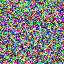
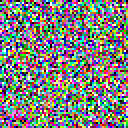
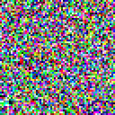
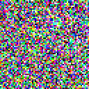
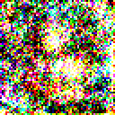
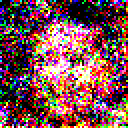
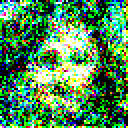
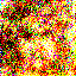

### New version, https://github.com/quickgrid/text-to-image-diffusion.

# Pytorch Diffusion

Implementation of diffusion models in pytorch for custom training. This code is mainly based on [this repo](https://github.com/dome272/Diffusion-Models-pytorch).

Models are implemented for `64 x 64` resolution output which are scaled 2x by nearest sampling to `128 x 128` resolution. In DDPM both training and reverse sampling requires around `T` steps. In DDIM reverse sampling can be done in small number of steps.


## Results

Results were upsampled from `64 x 64` trained model output to `128 x 128` by nearest interpolation. 

### DDPM

Stanford Cars and CelebA HQ Dataset with 500 reverse diffusion steps. GIF generated by skipping every 20 frames in reverse process.






### DDIM

CelebA HQ dataset with 30-50 reverse diffusion steps. No frames skipped during GIF generation.







## Instructions

Parent folder path should be provided in `dataset_path`. Inside it must be one or more folder with images. These folders are used as class information.

For fast training it is best to first resize to expected size and remove corrupted, low res images with tools in this repo.

**Large Minibatch Training**

For gradient accumulation `batch_size * accumulation_iters` is the actual expected minibatch size. If code `batch_size = 2` and `accumulation_iters = 16` then minibatch size for gradient calculation is 32.

If required minibatch size is 64 and `batch_size = 8` fits in memory then `accumulation_iters` should be 8.

**Resume Training**

To resume training `checkpoint_path` and `checkpoint_path_ema` should be provided.

**Sample Images**

This will generate 4 images each with regular and ema model.

```
trainer.sample(output_name='output', sample_count=4)
```

**Sample Gif**

The following will generate `out.gif` in chosen directory. The pretrained checkpoint paths must be provided to sample.

```
trainer.sample_gif(
    output_name='out',
    sample_count=2,
    save_path=r'C:\computer_vision\ddpm'
)
```

### Codes

| Name | Description |
| ----------- | ----------- |
| `ddpm.py` | DDPM implementation for testing new features. |
| `ddim.py` | DDIM implementation for testing new features. |

### Pretrained Checkpoints


Models are available in, https://huggingface.co/quickgrid/pytorch-diffusion. 

#### DDPM

Trained with linear noise schedule and `T = 500` noise steps. Only trained for 1 day without waiting for further improvement.

| Dataset | Download Link |
| ----------- | ----------- |
| [Stanford Cars]() | https://huggingface.co/quickgrid/pytorch-diffusion/blob/main/cars_61_4000.pt |
|  | https://huggingface.co/quickgrid/pytorch-diffusion/blob/main/cars_ema_61_4000.pt |
|  |  |
| [CelebA HQ]() | https://huggingface.co/quickgrid/pytorch-diffusion/blob/main/celeba_147_0.pt |
|  | https://huggingface.co/quickgrid/pytorch-diffusion/blob/main/celeba_ema_147_0.pt |


## Todo

- Match ddpm, ddim variable names, functions and merge code. 
- Class conditional generation.
- Classifier Free Guidance (CFG).
- Save EMA step number with checkpoint.
- Add super resolution with unet like imagen for 4X upsampling, `64x64 => 256x256 => 1024x1024`.
- Train and test with SWA EMA model. 
- Add loss to tensorboard.
- Check if overfitting, add validation.
- Convert to channel last mode.
- Transformer encoder block missing layer norm after MHA.
- Move test class to separate file.

## Issues

- Logging does not print in kaggle.

## References

- Annotated DDPM implementation, https://github.com/quickgrid/paper-implementations/tree/main/pytorch/ddpm.
- DDIM implementation, https://github.com/quickgrid/paper-implementations/tree/main/pytorch/ddim.
- DDPM Implementation, https://www.youtube.com/watch?v=TBCRlnwJtZU.
- DDPM Implementation, https://github.com/dome272/Diffusion-Models-pytorch.
- DDPM paper, https://arxiv.org/pdf/2006.11239.pdf.
- DDIM paper, https://arxiv.org/pdf/2010.02502.pdf.
- Improved DDPM, https://arxiv.org/pdf/2102.09672.pdf.
- Annotated Diffusion, https://huggingface.co/blog/annotated-diffusion.
- Keras DDIM, https://keras.io/examples/generative/ddim/.
- Postional embedding, http://nlp.seas.harvard.edu/annotated-transformer/.
- Attention paper, https://arxiv.org/pdf/1706.03762.pdf.
- Transformers, https://pytorch.org/tutorials/beginner/transformer_tutorial.html.
- Transformer encoder architecture, https://arxiv.org/pdf/2010.11929.pdf.
- UNet architecture, https://arxiv.org/pdf/1505.04597.pdf.
