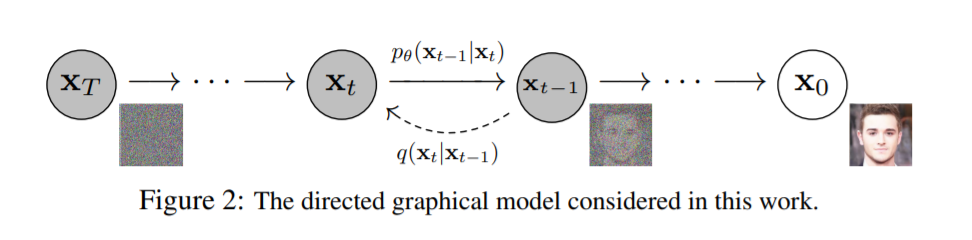

# Pytorch Diffusion

**This code is up to date version of, https://github.com/quickgrid/paper-implementations/tree/main/pytorch/denoising-diffusion.**

Implementation of diffusion models in pytorch for custom training. This code is mainly based on [this repo](https://github.com/dome272/Diffusion-Models-pytorch).

Only slow sampling is implemented so far with both train and test timesteps equal to `T`.  It may require atleast an hour or two to generate something recognizable based on dataset. Only `64 x 64` resolution is tested. 

### Results

Results were upsampled from `64 x 64` trained model output to `128 x 128` by nearest interpolation.

**Stanford Cars Dataset**

**CelebA HQ Dataset**

## Instructions

For gradient accumulation `batch_size * accumulation_iters` is the actual minibatch size. If code `batch_size = 2` and `accumulation_iters = 16` then minibatch size for gradient calculation is 32.

Parent folder path should be provided in `dataset_path`. Inside it must be one or more folder with images. These folders are used as class information.

For fast training it is best to first resize to expected size and remove corrupted, low res images with tools in this repo.

### Codes

| Name | Description |
| ----------- | ----------- |
| `ddpm.py` | Implementation for testing new features. |

### Pretrained Checkpoints

Models are available in, https://huggingface.co/quickgrid/pytorch-diffusion.

| Dataset | Download Link |
| ----------- | ----------- |
| [Stanford Cars]() | https://huggingface.co/quickgrid/pytorch-diffusion/blob/main/cars_61_4000.pt |
|  | https://huggingface.co/quickgrid/pytorch-diffusion/blob/main/cars_ema_61_4000.pt |
|  |  |
| [CelebA HQ]() | https://huggingface.co/quickgrid/pytorch-diffusion/blob/main/celeba_147_0.pt |
|  | https://huggingface.co/quickgrid/pytorch-diffusion/blob/main/celeba_ema_147_0.pt |

## Process

Noise is applied to images on each timestep `t` based on noise schedule. This is forward process `q` with larger `t` the more noise. A random timestep is chosen per minibatch based on which noise is generated that is used to corrupt input images. The image is passed to network that predicts the noise for given timestep. L1 or L2 loss calculated between predicted noise and image corruption noise. Algorithm 1 of DDPM paper is used train the network.

Sampling from trained network is reverse process `p` that generates denoised image. A random noise is passed through network for `T` steps that denoises the image. Algorithm 2 of DDPM paper is used for sampling.

### Features

- Annotated code with example and paper reference.
- Test code for model architecture, expected output.
- Tried to follow PEP-8 style code.
- Save and load model, ema model.
- Sampling with pretrained weights.
- Stochastic weight averaging (SWA) example and implementation. (Not tested)
- EMA (Exponential Moving Average) model.
- Linear, cosine noise scheduling.
- Learning rate scheduling.
- Sinusoidal positional embedding with dropout.
- Precalculated values for faster sampling.
- Mixed precision training.
- Gradient accumulation for large minibatch training to fit in low memory GPU.
- UNet with Attention layers.

## Todo

- Try to implement ddim.
- Class conditional generation.
- Classifier Free Guidance (CFG).
- Save EMA step number with checkpoint.
- Add super resolution with unet like imagen for 4X upsampling, `64x64 => 256x256 => 1024x1024`.
- Train and test with SWA EMA model. 
- Add loss to tensorboard.

## Issues

- Logging does not print in kaggle.

## References

- Annotated implementation, https://github.com/quickgrid/paper-implementations/tree/main/pytorch/denoising-diffusion.
- Implementation, https://www.youtube.com/watch?v=TBCRlnwJtZU.
- Implementation, https://github.com/dome272/Diffusion-Models-pytorch.
- DDPM paper, https://arxiv.org/pdf/2006.11239.pdf.
- DDIM paper, https://arxiv.org/pdf/2010.02502.pdf.
- Improved DDPM, https://arxiv.org/pdf/2102.09672.pdf.
- Annotated Diffusion, https://huggingface.co/blog/annotated-diffusion.
- Keras DDIM, https://keras.io/examples/generative/ddim/.
- Postional embedding, http://nlp.seas.harvard.edu/annotated-transformer/.
- Attention paper, https://arxiv.org/pdf/1706.03762.pdf.
- Transformers, https://pytorch.org/tutorials/beginner/transformer_tutorial.html.
